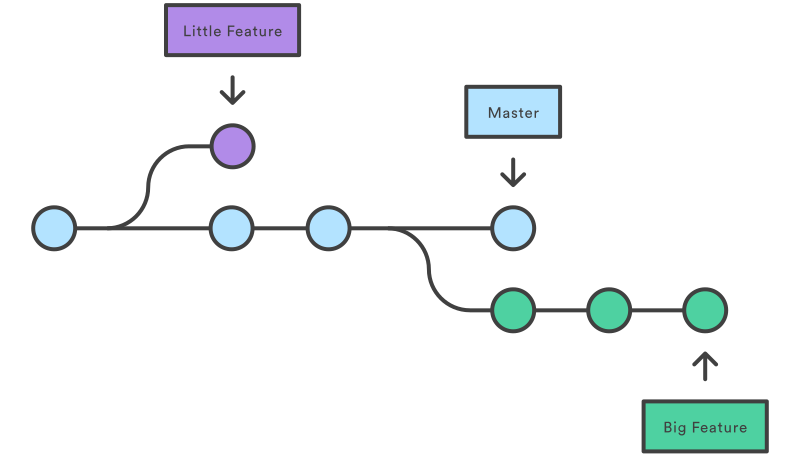
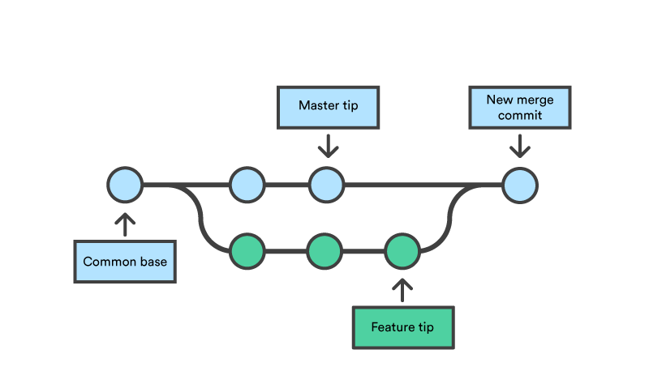
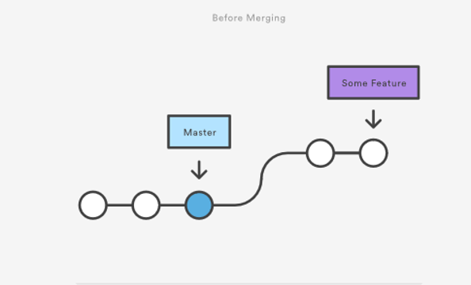
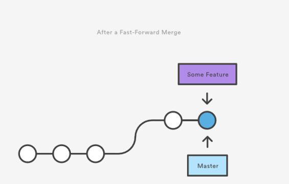

# Professional Practice: Git Seminar
_Adapted from Nice Reidman's interactive Git tutorial_

["Learn git concepts, not commands"](https://dev.to/unseenwizzard/learn-git-concepts-not-commands-4gjc)

[](https://gitpod.io#snapshot/10b5498d-ec6a-4ff6-a80b-d03376d487cb)

## Resources
- [Pro Git Book](https://git-scm.com/book/en/v2)
- [Introduction to GitHub course on GitLab](https://lab.github.com/githubtraining/introduction-to-github)
- [This tutorial in more depth](./TUTORIAL.md)

# Local Version Control


# Centralised Version Control


# Distributed Version Control


## Git Overview
<!--  -->


## Getting a Remote Repository
- Fork https://github.com/john-french/git_training
  - creates your own remote copy of a repository

- Get your copy of the remote repo onto your machine


```sh
git clone https://github.com/{YOUR USERNAME}/git_training.git
```

- creates a new directory called `git_training` on your machine


## Cloning a repository


## Adding new things
- Move to the repo directory and add a new file

```sh
cd git_training
echo "This is Bob" > Bob.txt
```
- Check the status of your working directory and view changes

```sh
git status
git diff
```


## Adding Changes


## Adding Changes
- Add changes to the staging area

```sh
git add Bob.txt
git diff --staged
```
- Commit changes to the local repo

```sh
git commit -m "Added Bob"
```
- Push changes to the remote

```sh
git push
```

<!-- ## Reviewing Change History -->


## Commit Messages: Bad


## Commit Messages: Good

<div class="highlighter-rouge"><pre class="highlight"><code>$ git log --oneline -5 --author pwebb --before "Sat Aug 30 2014"
5ba3db6 Fix failing CompositePropertySourceTests
84564a0 Rework @PropertySource early parsing logic
e142fd1 Add tests for ImportSelector meta-data
887815f Update docbook dependency and generate epub
ac8326d Polish mockito usage
</code></pre>
</div>


# Branching

## Branching


## Branching
- Create a new branch called `updateAlice`

```sh
git branch updateAlice
```

- Switch to the branch we just created

```sh
git checkout updateAlice
```

- Switch back to master

```sh
git checkout master
git branch
```

### Branching
- **Undo and use a shortcut instead**
- Delete branch `updateAlice`

```sh
git branch -d updateAlice
```

- Create and update branch in one go

```sh
git checkout -b updateAlice
git branch
```

### Creating a branch


### Checking out a branch


## Making Changes on a Branch
- Make a change to `Alice.txt` by adding more text

```sh
echo "More content added" >> Alice.txt
```

- Add and commit this change

```sh
git add Alice.txt
git commit -m "Updated Alice"
```

- Push these changes to the remote repository

```sh
git push
fatal: The current branch updateAlice has no upstream branch.
To push the current branch and set the remote as upstream, use

    git push --set-upstream origin updateAlice
```

- List remote branches

```sh
git branch -a
```

# Merging

## Merging
**Fast-Forward Merge**
- When **no new commits** have been added to the base branch

**3 Way Merge**
- When **new commits** have been added to the base branch
<!--  -->

## Fast Forward Merge: Before


## Fast Forward Merge: After


## Fast Forward Merge
- See the `Updated Alice` in commit history on `updateAlice` branch

```sh
git log
```

- Checkout master, notice that commit isn't on the master branch

```sh
git checkout master
git log
```

- Merge the `updateAlice` branch into `master`

```
git merge updateAlice
git log
```

## 3 Way Merge: Before


## 3 Way Merge: After


## 3 Way Merge
- Create new branch

```sh
git branch newAlice
```

- Make changes on master

```sh
echo "Some more stuff" >> Bob.txt
git add Bob.txt
git commit -m "Updated Bob"
```

- Checkout `newAlice` branch and make changes there

```sh
git checkout newAlice
echo "Even more stuff" >> Alice.txt
git add Alice.txt
git commit -m "Updated Alice again"
```

### 3 Way Merge
- **`master` and `updateAlice` have now diverged**

- Switch back to `master` and merge `newAlice`

```sh
git checkout master
git merge newAlice
```

- Notice new merge commit `Merge branch newAlice`

```sh
git log --pretty=short
commit 5296df5d5e21747385eed68b1195b05dfce99cfc (HEAD -> master)
Merge: 0c34535 e849430
Author: John French <john.french@gmit.ie>

    Merge branch 'newAlice'
```

## Merge Conflicts
- Create and checkout a new branch and make some changes on it

```sh
git checkout -b fixBob
echo "Hi! I'm Bob. I've been here for a while now." > Bob.txt
git add Bob.txt
git commit -m "Bob's here for a while"
```

- Checkout master and make changes to the same file

```sh
git checkout master
echo "Hi! I'm new here." > Bob.txt
git add Bob.txt
git commit -m "Bob's new here"
```

## Merge Conflicts
- Merging `fixBob` won't work, files have conflicting changes

```sh
git merge fixBob
Auto-merging Bob.txt
CONFLICT (content): Merge conflict in Bob.txt
Automatic merge failed; fix conflicts and then commit the result.
```

- View contents of `Bob.txt`

```
cat Bob.txt
<<<<<<< HEAD
Hi! I'm new here.
=======
Hi! I'm Bob. I've been here for a while now.
>>>>>>> fixBob
```

### Merge Conflicts
- Open file in text editor and fix conflict manually (or using a tool)
- Add and commit fixed file

```sh
git add Bob.txt
git commit
```

- Too messy! Cancel the merge

```sh
git merge --abort
```

# Getting Remote Changes
Keeping your copy of the repository up-to-date

## Fetch


## Pull


## Stashing
- Save work in progress that's not ready to commit

```sh
git stash
```

- List stashes

```sh
git stash list
```

- View a stash

```sh
git stash show
```

- Apply a stash (retrieve the changes)

```
git stash apply
```

<!-- ## Rebasing -->

# Useful Git Commands
- Keep notes of new commands you learn
- Build up a library of handy commands

## My Command Library
Action | Git Syntax
--- | ---
List tags and commit ids| `git show-ref --tags`
Squash last 4 commits into one commit with new message | `git reset --soft HEAD~4`
Amend last commit message | `git commit —amend`
Force push to remote (overwrites history, **Don't do this!**) | `git push -f origin`
List tags | `git tag -l`
Check out tag | `git checkout tags/<TAG>`
Show history in format [short SHA1] [message] | `git log --oneline`
Show sha1, author and message of a single commit | `git log --pretty=short -n 1 <SHA1>`
Check if object is present in repo and return its type | `git cat-file -t [SHA1]`
Get last common ancestor of two branches | `git merge-base branch1 branch2`
Abort a merge | `git merge --abort`
Create a new branch and check it out | `git checkout -b branch_name`
List remotes | `git remote -v`
Show details of remote | `git remote show remote_name`
Delete branch from remote | `git push origin :branch_name`
Resolve all conflicting files below a directory with the remote side of the merge (use ours for the local side) | `grep -lr '<<<<' . | xargs git checkout --theirs --`
Resolve conflics in specific file/directory | `git mergetool <file/directory>`
Reset resolved merge conflict to conflicted state | `git checkout -m <file>`
Remove local branches no longer present on remote | `git remote prune origin`
Reset local repo to nth commit behind current HEAD | `git reset --hard HEAD~n`
Revert commit without committing | `git revert -n <sha1>`
Stage changes interactively | `git add -p`
Checkout previously checked-out branch | `git checkout -`
Search in git command history | `CTRL-R`
Check out file from another branch | `git checkout <branch_name> -- <paths>`
Cherry pick a merge commit, appending a line saying “cherry picked from commit”  |  `git cherry-pick -x -m 1 <sha1>`
